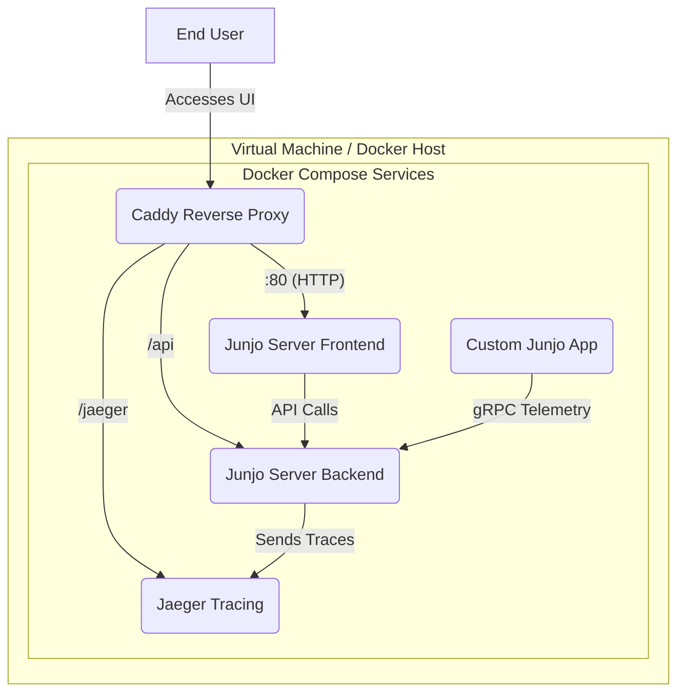

# Junjo Server Deployment Example

This repository provides a complete, deployable example of a custom Junjo application running alongside the Junjo Server in a Docker Compose environment. It is designed to be a starting point for users who want to build and deploy their own Junjo-powered applications.

## Architecture

The project consists of several containerized services orchestrated by Docker Compose. A Caddy reverse proxy serves as the entry point, routing traffic to the appropriate services.



## Prerequisites

*   [Docker](https://docs.docker.com/get-docker/)
*   [Docker Compose](https://docs.docker.com/compose/install/)

## Getting Started

### 1. Clone the Repository

```bash
git clone https://github.com/mdrideout/junjo-server-deployment-example.git
cd junjo-server-deployment-example
```

### 2. Configure Environment Variables

Copy the example environment file and update it with your own secret key.

```bash
cp .env.example .env
```

Open `.env` in your editor and replace `your-super-secret-key` with a new key. You can generate one with the following command:

```bash
openssl rand -base64 48
```

### 3. Run the Application

Start all the services using Docker Compose:

```bash
docker compose up --build
```

This command will build the `junjo-app` image and pull the necessary images for the other services. It may take a few minutes the first time you run it.

### 4. Access the Services

Once all the services are running, you can access them in your browser:

*   **Junjo Server UI**: [http://localhost](http://localhost)
*   **Jaeger UI for Tracing**: [http://localhost/jaeger](http://localhost/jaeger)

#### Junjo Setup Steps:

1. Create your user account with an email address and password, then sign in.
2. Create an [API key](http://localhost:5153/api-keys) in the Junjo Server UI.
3. Set the key as the `JUNJO_SERVER_API_KEY` environment variable in the `.env` file.
4. Restart the junjo-app container to pickup the new API key.


> **Troubleshooting:** If you see a "failed to get session" error in the logs or have trouble logging in, try clearing your browser's cookies for `localhost` and restarting the services.
> 
> This can be an issue if you have had multiple junjo server projects running on `localhost` and the session cookie is still valid in another instance.

You should see workflow runs appearing in the Junjo Server UI every 5 seconds. You can click on a run to see the detailed trace in Jaeger.

### 5. Stopping the Application

To stop all the services, press `Ctrl+C` in the terminal where `docker compose` is running. To remove the containers and their volumes, run:

```bash
docker compose down -v
```

## Services

### `junjo-app`

*   **Description**: A custom Python application that runs a simple Junjo workflow in a loop.
*   **Source**: [`junjo_app/`](junjo_app/)
*   **Details**: This application is configured to send OpenTelemetry data to the `junjo-server-backend` via gRPC. This allows you to see the workflow's execution traces in the Junjo Server UI.

### `junjo-server-backend`

*   **Description**: The backend service for the Junjo Server.
*   **Image**: `mdrideout/junjo-server-backend:latest`
*   **Details**: This service receives telemetry data, stores it, and serves the API for the frontend.

### `junjo-server-frontend`

*   **Description**: The web interface for the Junjo Server.
*   **Image**: `mdrideout/junjo-server-frontend:latest`
*   **Details**: This service provides the user interface for viewing workflow runs and telemetry.

### `junjo-jaeger`

*   **Description**: The Jaeger all-in-one instance for distributed tracing.
*   **Image**: `jaegertracing/all-in-one:latest`
*   **Details**: The Junjo Server is integrated with Jaeger to provide detailed traces of workflow executions.

### `caddy`

*   **Description**: A modern, powerful reverse proxy.
*   **Image**: `caddy:2-alpine`
*   **Details**: Caddy routes incoming traffic to the appropriate services based on the path. The configuration can be found in the [`Caddyfile`](Caddyfile). For production use, you would replace `localhost` with your domain name, and Caddy would automatically handle HTTPS for you.
